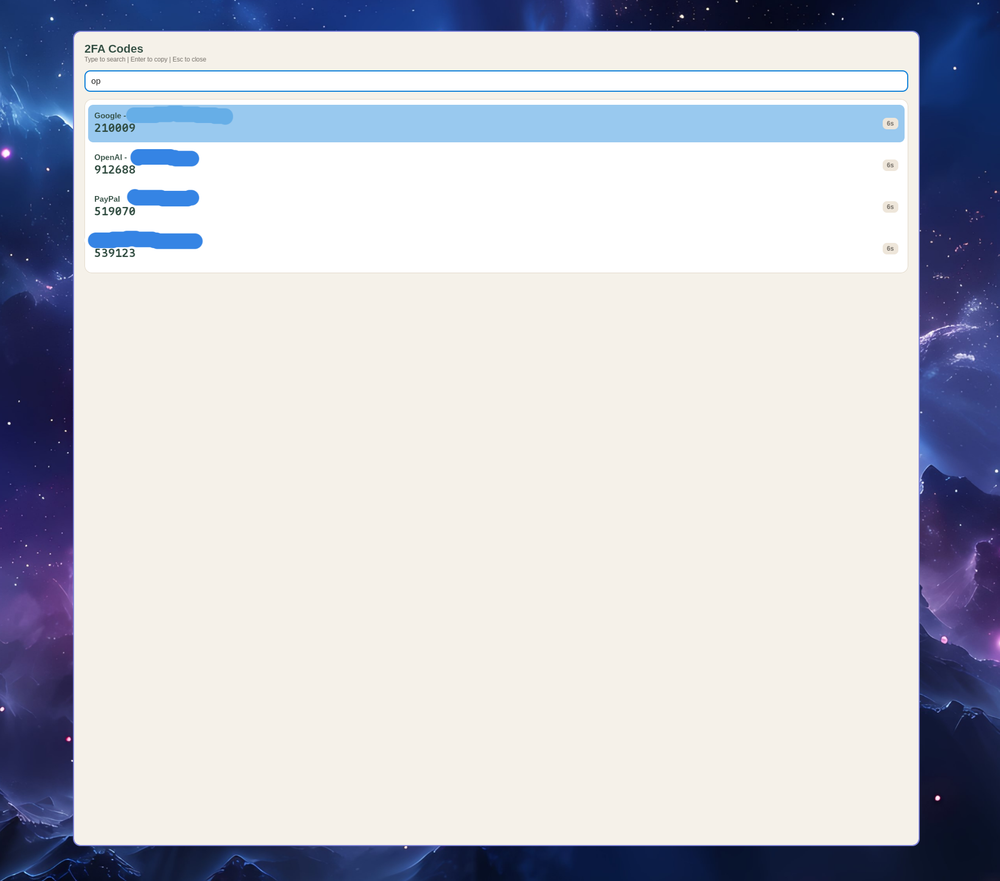

# QuickOTP

Your two-factor codes, one keypress away.

QuickOTP stores your 2FA accounts on your own machine and gives you three ways to get at them: a popup you summon with a hotkey, a desktop vault editor, and a terminal app.

## Overview

- [The 5-second workflow](#the-5-second-workflow)
- [Install the latest release](#install-the-latest-release)
- [Three ways to use it](#three-ways-to-use-it): [popup](#usage-popup), [editor](#usage-editor), and [console](#usage-console)
- [Requirements](#requirements), [build and run](#build-and-run), and [publishing](#publishing)
- [Data storage](#where-your-data-lives), [master password and keychain](#master-password-and-keychain), and [clipboard behavior](#clipboard-behavior)
- [Importing from 2FAS](#importing-from-2fas) and [security notes](#security-notes)
- [Under the hood](#under-the-hood)
- [License](#license)

## The 5-second workflow

This is the part I actually use every day. Bind the popup to a key, and getting a code looks like this:

1. Press your hotkey. Mine is `Super+Shift+A`.
2. Type a few letters of the site name, like `git` for GitHub.
3. Press `Enter`.

The code is on your clipboard and the window is already gone. Paste it and carry on.



Search is fuzzy and case-insensitive across both the issuer and the account name, so `gh` finds GitHub and `wrk` finds your work account. The top match is always preselected, which is why you can type and hit `Enter` without ever looking at the list. Each row shows the live code and how many seconds it has left.

Example Hyprland bind, using the Lua config from 0.55 onwards:
```lua
hl.bind(
  "SUPER + SHIFT + A",
  hl.dsp.exec_cmd("/path/to/QuickOTP.Popup"),
  { description = "2FA Codes" }
)
```

On Omarchy, the helper is shorter:
```lua
o.bind("SUPER + SHIFT + A", "2FA Codes", "/path/to/QuickOTP.Popup")
```

On Hyprland before 0.55, where the config is still hyprlang:
```ini
bindd = SUPER SHIFT, A, 2FA Codes, exec, /path/to/QuickOTP.Popup
```

Any keybinding tool works the same way. Point your shortcut at the popup executable and you are done.

## Install the latest release

The installers download the latest self-contained Popup and Editor builds, so the .NET runtime is not required.

### Arch Linux (x86_64)

```bash
curl -fsSL https://raw.githubusercontent.com/devmobasa/QuickOTP/main/install.sh | bash
```

Run `quickotp-editor` to manage your vault and `quickotp-popup` to open the popup. If `~/.local/bin` is not already in your `PATH`, the installer prints the path to use for your hotkey.

To run the tests and build the native apps from source instead of downloading release binaries:

```bash
curl -fsSL https://raw.githubusercontent.com/devmobasa/QuickOTP/main/install.sh | bash -s -- --build
```

The source build checks for the .NET 10 SDK first. If it is missing, the installer asks before downloading Microsoft's `dotnet-install.sh` and installing the SDK under `~/.dotnet`. It also asks before installing any missing Native AOT build packages.

On Omarchy, either install path also offers to install the `community.quickotp` bar widget. Click its key icon for the popup or right-click for the editor. Rerun the installer to update the app and its managed plugin. See [install.sh](install.sh) and the [Omarchy plugin](omarchy-plugin/community.quickotp) for the full sources.

### Windows (x64)

Run in PowerShell:

```powershell
irm https://raw.githubusercontent.com/devmobasa/QuickOTP/main/install.ps1 | iex
```

Run `quickotp-editor` or `quickotp-popup` from PowerShell, Command Prompt, or your launcher. See [install.ps1](install.ps1) for the full script.

## Three ways to use it

- **Popup** (`QuickOTP.Popup`): the hotkey window described above. Search, copy, gone.
- **Vault editor** (`QuickOTP.Editor`): a desktop app for adding, editing, and importing accounts.
- **Console** (`QuickOTP.Console`): a terminal UI for the same vault, handy over SSH or if you live in the terminal.

All three read the same encrypted account store, so it does not matter where you add an account.

## Requirements

- .NET 10 SDK to build. Native AOT publish on Linux also needs a C toolchain: `clang` and `zlib` on Arch, `clang zlib1g-dev` on Debian/Ubuntu
- Native AOT publishes produce a self-contained binary (no .NET runtime on the target machine)
- Framework-dependent `dotnet run` still needs the .NET 10 runtime
- The popup and editor also need a desktop session (Windows, macOS, or Linux with X11 or Wayland)

## Build and run

From the repo root:

```bash
dotnet build
```

```bash
dotnet run --project QuickOTP.Popup     # hotkey popup
dotnet run --project QuickOTP.Editor    # vault editor
dotnet run --project QuickOTP.Console   # terminal UI
```

Once you have a build you like, bind the popup to a hotkey as shown above. For daily use, publish it in Release and point the bind at that path so it starts as fast as possible.

## Usage (popup)

A small always-on-top window that opens centered and gets out of your way.

- Type to search
- `Up` and `Down` move the selection
- `Enter` copies the selected code and closes the window
- `Esc` closes without copying

## Usage (editor)

The vault editor is where you manage accounts.

- Search the list, or paste an `otpauth://` link into the search box to import it
- Click an account to edit issuer, name, secret, algorithm, digits, and period
- Live codes update in the list and in the chronometer preview
- Import 2FAS or JSON backups. Encrypted 2FAS files ask for a password
- Export to 2FAS (optional password) or JSON (optional local-key encryption)
- Shortcuts: `Ctrl+N` new account, `Ctrl+S` save, `Ctrl+F` search, `Enter` copy code

## Usage (console)

A menu-driven terminal UI:

- Show accounts and live codes
- Add accounts manually
- Import from an `otpauth://` URI
- Import and export JSON backups
- Import and export 2FAS backups (`.2fas`)
- Show an ASCII QR code for an account, so you can scan it onto your phone

`Enter` or `F7` copies the selected code.

An `otpauth://` URI looks like this:
```
otpauth://totp/Example:alice@google.com?secret=JBSWY3DPEHPK3PXP&issuer=Example
```

## Where your data lives

Accounts are stored per user, in the usual place for your OS:

- Linux: `$XDG_CONFIG_HOME/QuickOTP/accounts.json` (usually `~/.config/QuickOTP`)
- Windows: `%APPDATA%\QuickOTP\accounts.json`
- macOS: `~/Library/Application Support/QuickOTP/accounts.json`

Everything is encrypted at rest with AES-GCM. The key lives in your OS keychain by default, or in a `key.dat` file next to the vault. Nothing is uploaded anywhere.

Without a master password, you cannot just copy the data directory to another operating system. Use export and import instead.

## Master password and keychain

Set a master password if you want a vault you can move between machines:

- `QUICKOTP_MASTER_PASSWORD` or `QUICKOTP_MASTER_PASSWORD_FILE` (the file wins if both are set)
- The storage key is wrapped with PBKDF2 and stored in `key.dat`
- With a master password you can move `accounts.json` and `key.dat` to another OS and unlock with the same password
- `QUICKOTP_PBKDF2_ITERATIONS` tunes the work factor (minimum 10000, default 200000)

With no master password, QuickOTP uses your OS keychain:

- Linux: Secret Service through `secret-tool` (install `libsecret` or your distro's equivalent)
- Windows: Credential Manager
- macOS: Keychain through the `security` CLI, which may prompt for access
- `QUICKOTP_DISABLE_KEYCHAIN=1` forces the `key.dat` fallback
- `QUICKOTP_KEYCHAIN_SERVICE` and `QUICKOTP_KEYCHAIN_ACCOUNT` override the entry names

## Clipboard behavior

The console copies through TextCopy, falling back to `wl-copy`, `xclip`, or `xsel` on Linux. The popup uses the Avalonia clipboard APIs, and prefers `wl-copy` on Wayland when it is available, because that turned out to be the reliable path.

## Importing from 2FAS

Plain JSON backups work fine. Encrypted backups are best effort: the encryption format here is simplified and may not match the official 2FAS implementation in every case, so check that your accounts came across before you delete anything.

Encrypted JSON exports are tied to your local storage key. For a backup you can actually move somewhere else, export `.2fas` with a password.

## Publishing

Native AOT is enabled on the three apps. From the repo root:

```bash
dotnet publish QuickOTP.Popup -c Release -r linux-x64 --self-contained true
```

That writes a native `QuickOTP.Popup` plus Skia native libraries. Swap the project and RID as needed. Common RIDs:

- Linux: `linux-x64`, `linux-arm64`, `linux-musl-x64` (Alpine)
- Windows: `win-x64`, `win-arm64`
- macOS: `osx-x64`, `osx-arm64`

CI publishes glibc `linux-x64` Native AOT tarballs for Popup, Editor, and Console, plus `win-x64` ZIP files for Popup and Editor, on every push and pull request. The Linux binaries are built on Ubuntu 24.04, which means they run on Arch and other glibc x86_64 distros with a same-or-newer glibc. Tag a `v*` release to attach the same archives to a GitHub Release.

Popup and Editor publish clean. Console still links Terminal.Gui 1.19, which emits trim/AOT warnings; that assembly is rooted so the TUI still runs as a native binary.

Self-contained builds still depend on the target runtime ABI (glibc versus musl) and, for the popup and editor, on the desktop stack. "Any Linux distro" is not a promise anyone can make here.

If you want to ship this: `QuickOTP.Console` can become a .NET global tool with `PackAsTool` and package metadata, and `QuickOTP.Core` can be packaged as a NuGet library. Global tools are not Native AOT.

## Security notes

- Your account data is encrypted, but the key sits in the OS keychain or in `key.dat` on the same machine
- The backup encryption here is not a replacement for real key management
- Treat your secrets and backup files as sensitive, and do not share them

This started as an educational implementation. If you plan to lean on it in a serious setting, review the encryption and key management first.

## Under the hood

For the curious, the details nobody needs to read to use it:

- Standard TOTP as defined in RFC 6238, so codes match what any other authenticator would produce
- SHA1, SHA256, and SHA512, with 6 or 8 digits and a configurable period
- Accounts import from `otpauth://` URIs and 2FAS backup files
- Built on .NET 10, with Avalonia for the popup and editor and Terminal.Gui for the console

Project layout:

- `QuickOTP.Popup`: Avalonia hotkey popup
- `QuickOTP.Editor`: Avalonia vault editor
- `QuickOTP.Console`: Terminal.Gui TUI
- `QuickOTP.Core`: shared models and services
- `QuickOTP.Tests`: unit tests

Package versions are managed centrally in `Directory.Packages.props`.

## License

See `LICENSE`.
